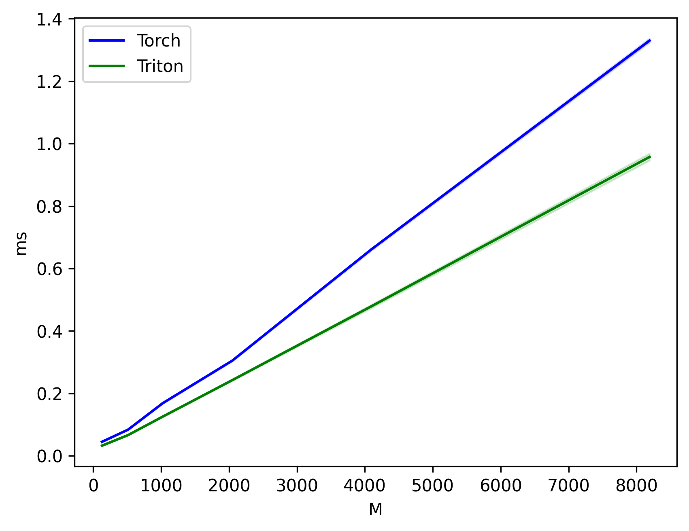
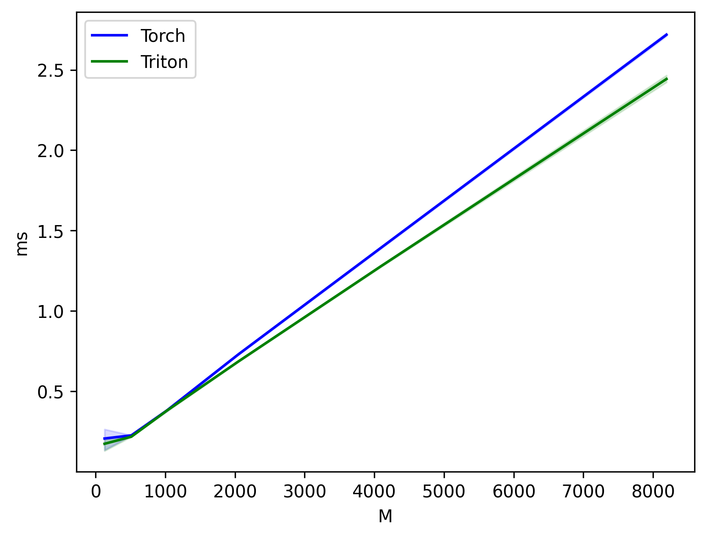

## Triton implementation of SwiGLU

A minimal Triton GPU kernel that fuses the SwiGLU MLP projections:

- **Inputs**: `x` with shape `(M, K)` or `(B, M, K)`; `W` with shape `(K, N)`; `V` with shape `(K, N)`
- **Output**: `y` with shape `(M, N)` or `(B, M, N)`

Mathematically, SwiGLU is:

$$
y = \mathrm{SwiGLU}(x) = \mathrm{SiLU}(a) \odot (b)
$$
where
$$
a = x W, \quad b = x V, \quad
\mathrm{SiLU}(a) = a \cdot \sigma(a), \quad \sigma(a) = \frac{1}{1 + e^{-a}}
$$

This repo provides fused Triton kernels for both forward and backward. The forward kernel computes both projections and the SiLU activation in one pass, and the custom backward kernel computes gradients w.r.t. `x`, `W`, and `V`. This reduces memory traffic and improves performance versus a naive PyTorch implementation.

### Setup
```bash
pip install torch triton matplotlib pandas
```

### Quick start

Check correctness (forward + backward):
```bash
python triton_swiglu_fused.py
```
Run benchmark:
```bash
python benchmark.py
```

### Benchmark Forward


### Benchmark Backward

